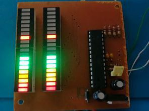

# Levelbar app
This repository contains code for a WPF app that shows level bars for a number of channels. Every channel represents a data channel in a data aquisition system similar to the those used at VIBES.

# Case 1: WPF levelbars

Your job is to visualize the data generated by the `LevelBarGenerator` as level bars. Every channel should have its own level bar. 

The level bars can be inspired by the following:

Some things to consider:

- The user of this app should be able to connect and disconnect the level bar generator.
- Create your WPF component such that it also displays properly if you resize the window.
- Level values are generated by the engine in the range from 0.0 - 1.0. VU meters typically use a logarithmic scale (e.g. in dB), which is more appropriate to visualize signal levels. Keep this in mind and make sure the signal dynamics can indeed be clearly observed.
- The levelbarGenerator will push data at a certain sampling rate and in intervals. You are free to not update the levelbars at this same sampling rate, to keep proper performance.
- On top of the display of the instantaneous level, the levelbar should have a 2 second peakhold like in the second picture (https://www.sweetwater.com/insync/peak-hold/)
